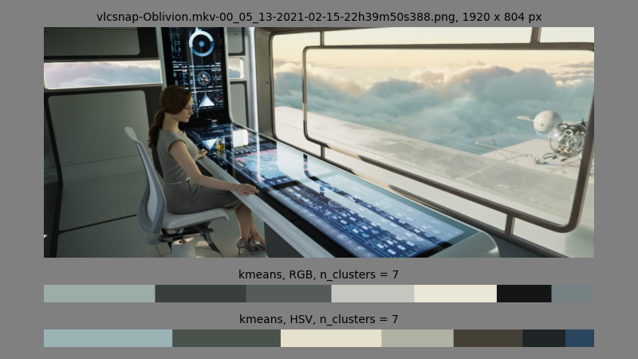

# colorkeys
Color Key Analysis in Film and Art.

<P align="center">
    
</P>

## About

This repository contains tools for color extraction from input images.

It is part of my exploration of color palette analysis in film and art. It is 
part-exercise and part-foundational project for building data analysis and machine 
learning tools for content creation.

There is **no support** for this project.

## Background

As both creator and consumer, I'm interested in the role of colors and color palettes
in narrative. One of the goals of this project is to detect underlying color patterns 
in sequential narrative and see how they correlate with story structure.

The first step is the detection of colors within a single frame/image. For this task,
this repo uses the _k-means_ clustering algorithm. An exploration of alternative
algorithms including _heirarchical agglomerative clustering_, will follow later.

https://en.wikipedia.org/wiki/K-means_clustering

## Installing

```
❯ python3 -m pip install git+https://github.com/JustAddRobots/colorkeys.git
```

## Usage

```
usage: colorkeys [-h] [-a {kmeans,mbkmeans} [{kmeans,mbkmeans} ...]] [--aws]
                 [-c {HSV,RGB} [{HSV,RGB} ...]] [-d] [--debug-api DEBUG_API] [-e] -i
                 IMAGES [IMAGES ...] [-j] [-l LOGID] -n NUM_CLUSTERS [--prefix PREFIX]
                 [-p] [-v]

Colorkeys Palette Analysis Tool

optional arguments:
  -h, --help            show this help message and exit
  -a {kmeans,mbkmeans} [{kmeans,mbkmeans} ...], --algos {kmeans,mbkmeans} [{kmeans,mbkme
ans} ...]
                        Clustering algorithm(s) for color detection
  --aws                 Access AWS resources for CI/CD
  -c {HSV,RGB} [{HSV,RGB} ...], --colorspaces {HSV,RGB} [{HSV,RGB} ...]
                        Colorspaces for color palette analysis
  -d, --debug           Print debug information
  --debug-api DEBUG_API                                                                                         Print API debug information
  -e, --export          Export JSON information to zip file                               -i IMAGES [IMAGES ...], --images IMAGES [IMAGES ...]                                                          Image(s) to process
  -j, --json            Print JSON information
  -l LOGID, --logid LOGID
                        Runtime log indentifier
  -n NUM_CLUSTERS, --num-clusters NUM_CLUSTERS
                        Number of clusters to detect
  --prefix PREFIX       Log directory prefix
  -p, --plot            Plot image and color key histogram bar
  -v, --version         Show version number and exit
```

## Example

```
❯ colorkeys -d -n7 -i vlcsnap-Contagion.m4v-01_35_02-2021-02-16-12h00m40s115.png
2022-02-27 00:31:52 - DEBUG [clihelper]: colorkeys v: 0.12.0
2022-02-27 00:31:52 - DEBUG [clihelper]: engcommon v: 0.7.0
2022-02-27 00:31:52 - DEBUG [clihelper]: {'algos': ['mbkmeans'],
 'aws': False,
 'colorspaces': ['RGB'],
 'debug': True,
 'debug_api': None,
 'export': False,
 'images': [['vlcsnap-Contagion.m4v-01_35_02-2021-02-16-12h00m40s115.png']],
 'json': False,
 'log_id': None,
 'num_clusters': 7,
 'plot': False,
 'prefix': '/tmp/logs'}
2022-02-27 00:31:52 - DEBUG [filepath]: {'./vlcsnap-Contagion.m4v-01_35_02-2021-02-16-12h00m40s115.png'}
2022-02-27 00:31:53 - DEBUG [cli]: {'cpu': 16384,
 'filehash': 'fe0855c85bf4f657',
 'filename': 'vlcsnap-Contagion.m4v-01_35_02-2021-02-16-12h00m40s115.png',
 'githash': '798fb6aa3e9852e4d77c0b06a2d61f0379bbf69b',
 'histogram': {'algo': 'mbkmeans',
               'colorspace': 'RGB',
               'hist_centroids': [{'color': [117, 149, 94], 'percent': 0.21011284722222223}, {'color': [75, 98, 54], 'percent': 0.18639130015432098},
                                  {'color': [55, 62, 27], 'percent': 0.1737326388888889}, {'color': [97, 125, 73], 'percent': 0.16056134259259258},
                                  {'color': [148, 173, 110], 'percent': 0.1332788387345679}, {'color': [149, 41, 5], 'percent': 0.07251736111111111},
                                  {'color': [189, 196, 124], 'percent': 0.06340567129629629}],
               'n_clusters': 7,
               'stopwatch': 0.13350391387939453},
 'memory': 217946,
 'shape': (1080, 1920, 3),
 'task_hash': '45950712',
 'timestamp': '2022-02-27T00:31:52.940597-08:00',
 'version': '0.12.0'}

```

## In Action

<P align="center">
	
</P>


## Challenges

### Uniqueness

The _k-means_ algorithm divides an image into _k_ groups (clusters) whose mean is a
coordinate value with a corresponding color value. It does a good job detecting
 colors that represent significant proportions of the image.

<P align="center">
    
</P>


But scant--yet prominent--colors often go undetected unless larger numbers of 
clusters are requested. For example, this still from the film _Yesterday_ shows 
some eye-catching colors that aren't detected.

<P align="center">
    
</P>


### Red

A related challenge involves prioritising the color _red_. Significant
social, cultural, and evolutionary reasons cause red to immediately draw our eyes.
Therefore, even small proportions of red may need to factor into the palette 
detection.

<P align="center">
    
</P>


### Medium

K-means seems proficient on my favourite style of comics (inked, flat color), even 
with a relatively small number of requested clusters (though adjustments will be needed
to handle the "analagous split-complementary" color schemes prevalent many works). 
This may mean a generalised algorithm for different mediums may be challenging.

<P align="center">
    
</P>


## Todo

Many of these challenges will be addressed in experiments with the clustering
algorithm (k-means v. heirarchical agglomerative clustering) and color space
(RGB v. HSV).


https://en.wikipedia.org/wiki/HSL_and_HSV  
https://en.wikipedia.org/wiki/Hierarchical_clustering  

## License

Licensed under GNU GPL v3. See **LICENSE.md**
