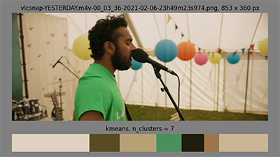

# colorkeys
Color Key Analysis in Film and Art.

## About

This repository contains tools for color extraction from input images.

It is part of my exploration of colour palette analysis in film and art. It is 
part-exercise and part-foundational project for building data analysis and machine 
learning tools for content creation.

There is **no support** for this project.

## Background

As both creator and consumer, I'm interested in the role of colours and colour palettes
in narrative. One of the goals of this project is to detect underlying color patterns 
in sequential narrative and see how they correlate with story structure.

The first step is the detection of colours within a single frame/image. For this task,
this repo uses the _k-means_ clustering algorithm. An exploration of alternative
algorithms including _heirarchical agglomerative clustering_, will follow later.

https://en.wikipedia.org/wiki/K-means_clustering

## Installing

```
❯ python3 -m pip install git+https://github.com/JustAddRobots/colorkeys.git
```

## Usage

```
usage: colorkeys [-h] [-d] [-a {kmeans}] [-c {RGB}] -i IMAGE -n NUM_CLUSTERS [-l LOGID]
                 [-p PREFIX] [-v]

Colorkeys Palette Analysis Tool

optional arguments:
  -h, --help            show this help message and exit
  -d, --debug           print debug information
  -a {kmeans}, --algos {kmeans}
                        set clustering algorithm
  -c {RGB}, --colorspace {RGB}
                        set color space
  -i IMAGE, --image IMAGE
                        set image
  -n NUM_CLUSTERS, --num_clusters NUM_CLUSTERS
                        set number of cluster centroids
  -l LOGID, --logid LOGID
                        set runtime log indentifier
  -p PREFIX, --prefix PREFIX
                        set log directory prefix
  -v, --version         show program's version number and exit
```

## Example
```
❯ colorkeys -d -n 7 -i "vlcsnap-Moonlight.m4v-00_17_40-2021-02-06-22h44m00s410.png"
2021-02-06 23:37:18 - INFO [clihelper]: colorkeys v: 0.1.0
2021-02-06 23:37:18 - DEBUG [clihelper]: engcommon v: 0.6.3
2021-02-06 23:37:18 - DEBUG [clihelper]: {'algos': ['kmeans'],
 'colorspace': 'RGB',
 'debug': True,
 'image': 'vlcsnap-Moonlight.m4v-00_17_40-2021-02-06-22h44m00s410.png',
 'log_id': None,
 'num_clusters': 7,
 'prefix': '/tmp/logs'}
2021-02-06 23:37:26 - DEBUG [cli]: time: 7.55s
2021-02-06 23:37:26 - DEBUG [cli]: shape: (808, 1920, 3)
2021-02-06 23:37:26 - DEBUG [cli]: histogram: array([0.24788508, 0.10517353, 0.10802973, 0.07232751, 0.14564382, 0.07213284, 0.2488075 ])
```

## Challenges

### Uniqueness

The _k-means_ algorithm divides an image into _k_ groups (clusters) whose mean is a
coordinate value with a corresponding colour value. It does a good job detecting
 colours that represent significant proportions of the image.

<P align="center">
    
</P>


But scant--yet prominent--colours often go undetected unless larger numbers of 
clusters are requested. For example, this still from the film _Yesterday_ shows 
some eye-catching colours that aren't detected.

<P align="center">
    
</P>


### Red

A related challenge involves prioritising the colour _red_. Significant
social, cultural, and evolutionary reasons cause red to immediately draw our eyes.
Therefore, even small proportions of red may need to factor into the palette 
detection.

<P align="center">
    
</P>


### Medium

K-means seems proficient on my favourite style of comics (inked, flat colour), even 
with a relatively small number of requested clusters (though adjuments will be needed
to handle the "analagous split-complementary" colour schemes prevalent many works). 
This may mean a generalised algorithm for different mediums may be challenging.

<P align="center">
    
</P>


## Todo

Many of these challenges will be addressed in experiments with the clustering
algorithm (k-means v. heirarchical agglomerative clustering) and colour space
(RGB v. HSV).


https://en.wikipedia.org/wiki/HSL_and_HSV  
https://en.wikipedia.org/wiki/Hierarchical_clustering  

## License

Licensed under GNU GPL v3. See **LICENSE.md**
